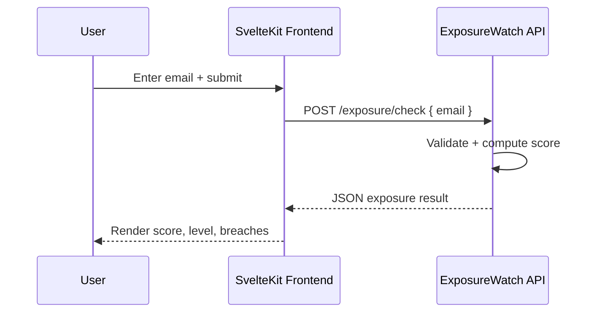
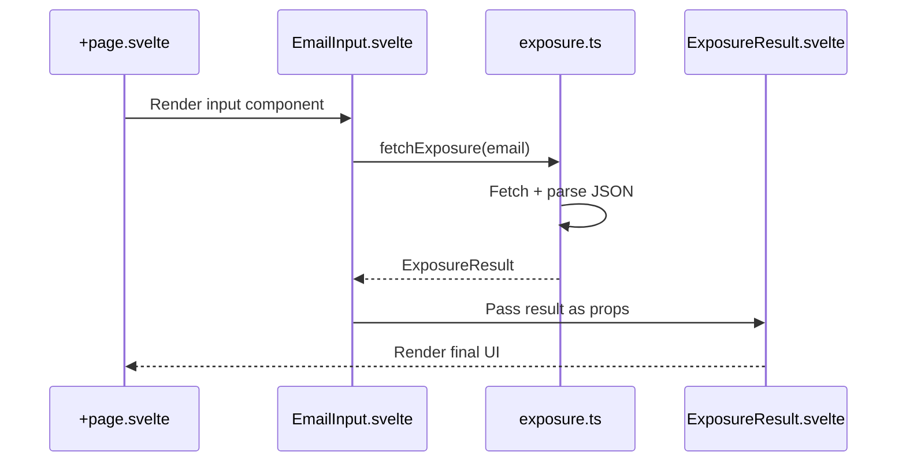
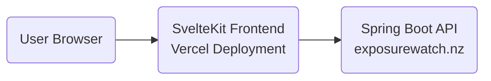
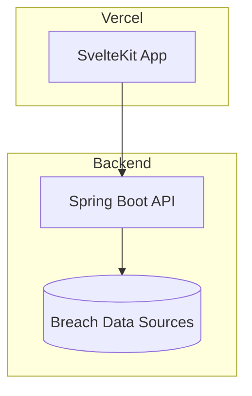

# Full API Reference (Frontend + Backend)

> [Return to README](https://github.com/lukeponga-dev/exposurewatch/README.md)

## 1. POST /exposure/check

### Request

`POST {PUBLIC_API_BASE_URL}{PUBLIC_EXPOSURE_CHECK_PATH}`
 `Content-Type: application/json`

### Body

```json
{
  "email": "string"
}
```

### Response

```json
{
  "email": "test@example.com",
  "score": number,
  "level": "Low" | "Medium" | "High" | "Critical",
  "breaches": [
    {
      "breachName": "string",
      "dataClasses": ["string", ...]
    }
  ]
}
```

### Status Codes

| Code | Meaning |
| --- | --- |
| 200 | Exposure report returned |
| 400 | Invalid JSON request |
| 502 | Exposure provider unavailable |
| 503 | Exposure service is not configured |

---

## 2. Frontend API Wrapper

`fetchExposure(email: string): Promise<ExposureResult>`
 Located in: `src/lib/api/exposure.ts`

### Types

```typescript
export interface ExposureResult {
  email: string;
  score: number;
  level: "Low" | "Medium" | "High" | "Critical";
  breaches: Breach[];
}

export interface Breach {
  breachName: string;
  dataClasses: string[];
}
```

The backend controller and model records are authoritative for the wire contract. See the [canonical API contract](docs/api.md) for normalization, scoring, form requests, health, and error details.

### 🔁 Sequence Diagrams

**1. Email Exposure Check Flow**



**2. Frontend Internal Flow**



---

## **Deployment Architecture Diagrams**

**1. High-Level Deployment**



**2. Infrastructure Layout**


